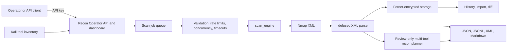

# Recon Operator

**A security-focused multi-tool recon control plane: Nmap engine, Kali inventory, review-only planner, encrypted results, and an operator dashboard.**

[](https://github.com/hafych/nmap-automator/actions/workflows/ci.yml)
[](https://www.python.org/)
[](https://nmap.org/)
[](LICENSE)

> Formerly **Nmap Automator**. The product is not Nmap-only: it orchestrates authorized recon around Nmap, Kali tool inventory, multi-tool follow-up plans, AI-readable exports, and encrypted history.

> [!IMPORTANT]
> **Beta:** APIs and artifact formats may still change before the first stable release. Open an issue with the command and environment if a workflow breaks on your platform.

> [!WARNING]
> Use this project only on systems you own or are explicitly authorized to assess.
> Unauthorized scanning may be illegal and disruptive.

## Why Recon Operator?

Running one scanner is easy. Operating repeatable recon safely is harder. This project adds the controls and artifacts operators need without auto-exploiting targets.

| Need | What Recon Operator adds |
| --- | --- |
| Repeatable recon | Immediate and recurring profiles: TCP, SYN, UDP, Version, Safe, Vuln, Full, OS, Aggressive, Ping |
| Multi-tool awareness | Kali essentials + 13 metapackage profiles; review-only recon plans (curl, whatweb, ssh-audit, …) |
| Control surface | Async Quart API plus a responsive browser dashboard |
| Safer operation | API-key auth, target bounds, rate limits, concurrency limits, timeouts |
| Protected results | Fernet encryption, atomic replacement, retention, owner-only permissions |
| Automation handoff | XML, JSON, JSONL, Markdown, manifests, job history, scan diffs |
| AI-assisted analysis | Compact observation streams and install-aware follow-up suggestions (never auto-executed) |

## Quick start

### Docker Compose

```bash
git clone https://github.com/hafych/nmap-automator.git
cd nmap-automator

cp .env.example .env
python3 -c "import base64, os; print(base64.urlsafe_b64encode(os.urandom(32)).decode())"
openssl rand -hex 32
```

Put the generated values into `.env` as `FERNET_KEY` and `API_AUTH_TOKEN`, then run:

```bash
docker compose up --build -d
docker compose ps
```

Open [http://127.0.0.1:5000](http://127.0.0.1:5000), enter the API token, and run a
TCP or Ping scan against an authorized target.

### Local Python

Requirements: Python 3.10+, Nmap on `PATH`, a Fernet key, and a strong API token.

```bash
# Debian, Ubuntu, or Kali
sudo apt-get update && sudo apt-get install -y nmap

# macOS
brew install nmap

python3 -m venv .venv
source .venv/bin/activate
python -m pip install -r requirements.txt
cp .env.example .env
python autonmap.py
```

The service binds to `127.0.0.1:5000` by default. Default `TCP` is unprivileged;
`SYN`, `UDP`, `OS`, and parts of `Aggressive` may require elevated network privileges.

## How it works



The planner never executes its recommendations. It shell-quotes fields, marks each
command as `ready`, `missing`, or `unknown`, and leaves execution to the operator.

## Core workflows

### Run an immediate scan

Scans are queued as jobs by default (`202 Accepted`). Poll until completion, or pass
`?wait=1` for a blocking response.

```bash
export API_TOKEN='replace-with-your-token'

curl -X POST http://127.0.0.1:5000/scan \
  -H "X-API-KEY: $API_TOKEN" \
  -H 'Content-Type: application/json' \
  -d '{"target":"127.0.0.1","scan_type":"Version","ports":"22,80,443"}'
# -> {"job_id":"...","status":"queued",...}

curl -H "X-API-KEY: $API_TOKEN" http://127.0.0.1:5000/jobs/<job_id>

curl -X POST 'http://127.0.0.1:5000/scan?wait=1' \
  -H "X-API-KEY: $API_TOKEN" \
  -H 'Content-Type: application/json' \
  -d '{"target":"127.0.0.1","scan_type":"Ping"}'
```

Supported `scan_type` values: `TCP`, `SYN`, `UDP`, `OS`, `Aggressive`, `Ping`,
`Version`, `Safe`, `Vuln`, `Full`, plus hybrid discovery profiles `Hybrid`,
`HybridNaabu`, and `HybridRustScan` (fast port discovery → Nmap `-sV` on open ports).
Optional `ports`, `scripts`, and `discovery` (`auto`|`naabu`|`rustscan`|`none`) fields
are accepted. Naabu/RustScan are optional PATH tools — not required for pure Nmap profiles.

Scheduled tasks and job history are stored in SQLite (`STATE_DB_PATH`, default
`data/recon_operator.db`) so restarts restore schedules and completed job metadata.

### Schedule, history, import, diff

```bash
curl -X POST http://127.0.0.1:5000/schedule \
  -H "X-API-KEY: $API_TOKEN" \
  -H 'Content-Type: application/json' \
  -d '{"target":"192.168.1.0/24","scan_type":"TCP","interval":30}'

curl -H "X-API-KEY: $API_TOKEN" http://127.0.0.1:5000/results
curl -H "X-API-KEY: $API_TOKEN" http://127.0.0.1:5000/results/<filename>

curl -X POST http://127.0.0.1:5000/results/import \
  -H "X-API-KEY: $API_TOKEN" \
  -H 'Content-Type: application/json' \
  -d '{"xml":"<?xml ... nmaprun ...>","target":"lab"}'

curl -X POST http://127.0.0.1:5000/results/diff \
  -H "X-API-KEY: $API_TOKEN" \
  -H 'Content-Type: application/json' \
  -d '{"baseline":{"id":"old.json"},"current":{"id":"new.json"}}'
```

### AI-readable scan artifacts (CLI)

```bash
python kali_ai_scan.py deps
python kali_ai_scan.py run 127.0.0.1 --profile tcp --out ai_reports
python kali_ai_scan.py parse nmap.xml --out ai_reports/imported-scan
```

### Inventory Kali tools and build a recon plan

```bash
# API
curl -H "X-API-KEY: $API_TOKEN" 'http://127.0.0.1:5000/tools?expand=0'
curl -H "X-API-KEY: $API_TOKEN" 'http://127.0.0.1:5000/tools/ai-context?format=jsonl'

# Standalone CLI (no API server required)
python tool_inventory.py --format json
python tool_inventory.py --format jsonl -o inventory.jsonl
python tool_inventory.py --format markdown --profiles recon web

curl -X POST \
  -H "X-API-KEY: $API_TOKEN" \
  -H 'Content-Type: application/json' \
  --data-binary @scan-result.json \
  'http://127.0.0.1:5000/recon/plan?format=markdown'

curl http://127.0.0.1:5000/live
curl http://127.0.0.1:5000/ready
curl http://127.0.0.1:5000/openapi.json
```

## API surface

| Method | Route | Purpose |
| --- | --- | --- |
| `GET` | `/` and `/ui` | Browser dashboard |
| `GET` | `/static/*` | Dashboard CSS/JS/favicon assets (public cache) |
| `GET` | `/favicon.ico` | Favicon (SVG) |
| `GET` | `/live` | Liveness probe (process up) |
| `GET` | `/ready` | Readiness probe (Nmap available) |
| `GET` | `/health` | Detailed health snapshot |
| `GET` | `/openapi.json` | OpenAPI 3 schema |
| `GET` | `/api/docs` | Runtime API description |
| `POST` | `/scan` | Queue immediate scan (`202`); `?wait=1` blocks |
| `GET` | `/jobs` | List scan jobs |
| `GET` | `/jobs/<id>` | Job status and result |
| `DELETE` | `/jobs/<id>` | Cancel a queued or running job |
| `POST` | `/schedule` | Recurring scan |
| `GET` | `/tasks` | List scheduled tasks |
| `DELETE` | `/tasks/<id>` | Cancel a scheduled task |
| `GET` | `/results` | List encrypted result files |
| `GET` | `/results/<id>` | Decrypt and return a stored result |
| `POST` | `/results/import` | Import Nmap XML into encrypted history |
| `POST` | `/results/diff` | Diff two scan results |
| `GET` | `/tools` | Kali tool inventory |
| `GET` | `/tools/ai-context` | JSONL or Markdown inventory context |
| `POST` | `/recon/plan` | JSON or Markdown multi-tool follow-up plan |

## Security model

The default deployment is intentionally local and single-operator:

- authentication is required by default (one or more API tokens);
- dashboard CSP uses per-response nonces plus `'self'` for `/static/*` (no `unsafe-inline`);
- static UI assets and favicon are served with short public cache headers;
- the server and Compose port bind to loopback;
- scan types are allow-listed and targets are bounded;
- subprocesses use argv rather than a shell;
- Nmap XML uses an XXE-safe parser;
- result files are encrypted with Fernet and written atomically;
- recon recommendations are never auto-executed;
- the default container runs non-root with a read-only root filesystem and
  `no-new-privileges`.

This is not a multi-tenant authorization system. See [SECURITY.md](SECURITY.md).

## Configuration

| Variable | Default | Purpose |
| --- | ---: | --- |
| `FERNET_KEY` | required | Key used to encrypt stored results |
| `API_AUTH_TOKEN` | required* | Primary token expected in the API authentication header |
| `API_AUTH_TOKENS` | empty | Optional extra tokens (comma list or JSON array); full admin access |
| `API_AUTH_KEYS` | empty | Optional named keys JSON: `id`, `label`, `token`, `scopes`, `created_at`, `revoked` |
| `API_AUTH_REQUIRED` | `true` | Disable only for isolated local development |
| `API_AUTH_HEADER` | `X-API-KEY` | Header carrying the API token |

\* At least one of `API_AUTH_TOKEN` / `API_AUTH_TOKENS` / `API_AUTH_KEYS` is required when auth is enabled.
Multiple tokens are isolated by ownership: jobs, scheduled tasks, and new encrypted
results are tagged with a hash of the presenting token. Named keys support least-privilege
scopes: `read` (history/tools/plan), `scan` (create/cancel; includes read), `admin` (all).
Call `GET /auth/whoami` to confirm key id, label, and scopes without exposing the secret.

| `APP_HOST` | `127.0.0.1` | Bind address |
| `APP_PORT` | `5000` | Listen port |
| `MAX_CONCURRENT_SCANS` | `2` | Maximum concurrent scans |
| `MAX_SCHEDULED_TASKS` | `100` | Maximum retained recurring scans |
| `MAX_SCAN_JOBS` | `200` | Maximum retained scan jobs in memory |
| `SCAN_TIMEOUT_SECONDS` | `1800` | Total Nmap process timeout |
| `NMAP_HOST_TIMEOUT_SEC` | `300` | Nmap per-host timeout |
| `NMAP_MAX_RETRIES` | `2` | Nmap probe retries |
| `MAX_TARGET_ADDRESSES` | `4096` | Largest accepted CIDR range |
| `TARGET_ALLOWLIST` | empty | Optional engagement scope: IPs, CIDRs, hostnames, `*.domain` (comma or JSON) |
| `TARGET_ALLOWLIST_FILE` | empty | Optional file of allowlist entries (`#` comments allowed); empty = unrestricted |
| `MAX_REQUEST_BODY_BYTES` | `1048576` | Maximum JSON request body size |
| `MAX_IMPORT_XML_BYTES` | `67108864` | Maximum imported Nmap XML size |
| `MAX_REQUESTS_PER_WINDOW` | `10` | Per-client costly-request limit |
| `MAX_RATE_LIMIT_CLIENTS` | `10000` | Maximum retained client buckets (memory backend) |
| `RATE_LIMIT_WINDOW_SECONDS` | `60` | Rate-limit window |
| `REDIS_URL` | empty | Optional Redis URL for shared rate limits and job-lease fence |
| `REDIS_RATE_LIMIT_PREFIX` | `recon_operator:rl:` | Key prefix for Redis rate-limit sorted sets |
| `RATE_LIMIT_INCLUDE_OWNER` | `true` | Bucket by IP + token owner hash (multi-token isolation) |
| `WORKER_ID` | random | Stable worker identity for job leases (set per process) |
| `JOB_LEASE_SECONDS` | `90` | How long a worker holds an exclusive scan-job lease |
| `JOB_CLAIM_POLL_SECONDS` | `2` | Poll interval for reclaiming queued / expired-lease jobs |
| `REDIS_JOB_LEASE_PREFIX` | `recon_operator:job_lease:` | Redis key prefix for optional job-lease fence |
| `SCHEDULER_LEADER_SECONDS` | `30` | Leadership lease for recurring schedules |
| `SCHEDULER_LEADER_POLL_SECONDS` | `5` | How often workers contest/renew scheduler leadership |
| `REDIS_LEADER_PREFIX` | `recon_operator:leader:` | Redis key prefix for optional leadership fence |
| `MIN_SCHEDULE_INTERVAL_MINUTES` | `1` | Smallest recurring-scan interval |
| `MAX_SCHEDULE_INTERVAL_MINUTES` | `10080` | Largest interval, in minutes |
| `RESULTS_DIR` | `encrypted_results` | Encrypted result directory |
| `RESULTS_MAX_FILES` | `500` | Max encrypted result files retained |
| `RESULTS_MAX_AGE_DAYS` | `0` | Delete results older than N days (`0` = off) |
| `LEGACY_RESULTS_SHARED` | `true` | Show pre-ownership result files to any auth operator; set `false` for multi-token isolation |
| `STATE_DB_PATH` | `data/recon_operator.db` | SQLite for jobs + scheduled tasks |
| `AI_REPORTS_MAX_DIRS` | `100` | Max CLI `ai_reports` run directories retained |
| `AI_REPORTS_MAX_AGE_DAYS` | `0` | Delete CLI report dirs older than N days (`0` = off) |
| `SCAN_LOG_PATH` | `logs/scan_log.txt` | Rotating application log |
| `TOOL_INVENTORY_CACHE_SECONDS` | `300` | Kali inventory cache lifetime |
| `INITIAL_TASKS` | `[]` | JSON array of startup recurring scans |
| `TELEGRAM_BOT_TOKEN` | empty | Optional Telegram bot token |
| `TELEGRAM_CHAT_ID` | empty | Optional Telegram destination |

## Encrypted results

```bash
python decrypt.py encrypted_results/<result>.json
python decrypt.py encrypted_results/<result>.json -o result.json
```

### Ownership and migration (1.7+)

New encrypted result filenames look like `o{12hex}_{target}_{type}_{timestamp}.json`,
where `{12hex}` is the first 12 hex characters of `sha256(api_token)`. Jobs and scheduled
task ids use the same owner hash prefix.

| Situation | Behavior |
| --- | --- |
| Single token (default) | Same as before; new files get an owner prefix, all APIs work |
| Multiple tokens | Each operator only sees their jobs, schedules, and owned result files |
| Pre-1.7 result files (no `o…_` prefix) | Visible to any authenticated operator while `LEGACY_RESULTS_SHARED=true` |
| Multi-token harden | Set `LEGACY_RESULTS_SHARED=false` to hide unowned legacy files |

Clients that previously assumed `POST /scan` always returned the scan body should use
`?wait=1` or poll `GET /jobs/<job_id>`. Cancel scripts should use the `task_id` returned
from `POST /schedule` (now `o{owner}-target-type`).

## Docker notes

```bash
docker compose logs -f

docker build -f dockerfile -t recon-operator .
docker run --rm \
  -p 127.0.0.1:5000:5000 \
  -e API_AUTH_TOKEN \
  -e FERNET_KEY \
  recon-operator
```

### Optional Redis rate limits

Single-worker deploys need no Redis (in-process buckets). For multiple workers or
instances, share the sliding window:

```bash
# start optional redis profile
docker compose --profile redis up -d

# in .env
REDIS_URL=redis://127.0.0.1:6379/0
```

`/health` reports `rate_limit_backend` as `memory`, `redis`, or `memory_fallback`.

### Multi-worker job leases

Scan jobs are claimed with an exclusive lease in SQLite (`lease_owner` / `lease_until`).
Only the claiming worker runs the Nmap process. A background claim loop recovers
`queued` jobs and expired leases after crashes. When `REDIS_URL` is set, a Redis
`SET NX` fence adds a second lock for multi-host deploys sharing the same state DB.

```bash
# process A
WORKER_ID=worker-a STATE_DB_PATH=/shared/recon.db REDIS_URL=redis://127.0.0.1:6379/0 python autonmap.py

# process B
WORKER_ID=worker-b STATE_DB_PATH=/shared/recon.db REDIS_URL=redis://127.0.0.1:6379/0 python autonmap.py
```

Recurring schedules use **scheduler leader election** (SQLite `leadership` table + optional
Redis fence). Only the leader runs `periodic_scan` loops; other workers persist
`POST /schedule` and cancel requests to the shared DB, and the leader syncs them.

## Development

```bash
python -m pip install -r requirements-dev.txt
ruff format --check .
ruff check .
python -m coverage run -m unittest discover -v
python -m coverage report
# Optional browser smoke + axe a11y (needs: python -m playwright install chromium)
RUN_E2E=1 python -m unittest discover -s e2e -v
bandit -q -ll -r . \
  -x ./.venv,./test_autonmap.py,./test_decrypt.py,./test_kali_ai_scan.py,./test_recon_planner.py,./test_scan_engine.py,./test_tool_inventory.py,./test_openapi_contract.py,./e2e
pip-audit -r requirements.txt
```

## Project layout

| Path | Responsibility |
| --- | --- |
| `autonmap.py` | Compatibility entrypoint (`import autonmap` / `python autonmap.py`) |
| `recon_operator/` | Application package (server, auth, jobs, scheduler, api, config) |
| `recon_operator/server.py` | Quart app, routes, jobs, scheduling, encryption |
| `scan_engine.py` | Nmap runner, hybrid Naabu/RustScan discovery, import, diff |
| `state_store.py` | SQLite persistence for jobs and schedules |
| `ui.py` | Operator dashboard HTML shell (CSS/JS in `static/`) |
| `static/` | Cacheable dashboard assets (`dashboard.css`, `dashboard.js`, `favicon.svg`) |
| `kali_ai_scan.py` | CLI Nmap runner, safe XML parser, AI artifact generator |
| `tool_inventory.py` | Kali package and command inventory |
| `recon_planner.py` | Service-aware multi-tool follow-up plans (review-only) |
| `decrypt.py` | Fernet result decryption utility |
| `test_*.py` / `e2e/` | Unit, contract, and browser regression tests |

Start the API with any of:

```bash
python autonmap.py
python -m recon_operator
```

## Contributing

Bug reports, focused improvements, and platform-specific validation are welcome. Please read
[CONTRIBUTING.md](CONTRIBUTING.md) and use private reporting for security vulnerabilities.

Repository path may still be `nmap-automator` on GitHub for continuity; the product name is
**Recon Operator**.

## License

GNU General Public License v3.0. See [LICENSE](LICENSE).
