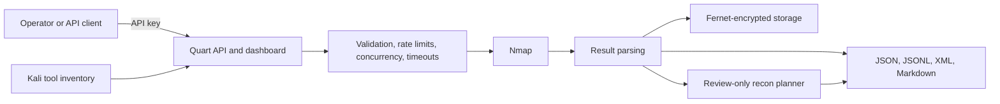

# Nmap Automator

**A security-focused Nmap orchestration API and dashboard for repeatable, authorized network reconnaissance.**

> [!IMPORTANT]
> **Beta:** APIs and artifact formats may change before the first stable release. If a workflow breaks on your platform, please open an issue with the command and environment details.

[](https://github.com/hafych/nmap-automator/actions/workflows/ci.yml)
[](https://www.python.org/)
[](https://nmap.org/)
[](LICENSE)

Nmap Automator turns Nmap into an operator-friendly workflow: launch or schedule scans,
track tasks in a browser, keep results encrypted at rest, inventory Kali tools, and export
clean JSON, JSONL, Markdown, and XML for analysis pipelines and AI assistants.

> [!WARNING]
> Use this project only on systems you own or are explicitly authorized to assess.
> Unauthorized scanning may be illegal and disruptive.

## Why Nmap Automator?

Running one Nmap command is easy. Operating repeatable scans safely is harder. This project
adds the controls and artifacts needed around Nmap without hiding the scanner itself.

| Need | What Nmap Automator adds |
| --- | --- |
| Repeatable reconnaissance | Immediate and recurring TCP, SYN, UDP, OS, aggressive, and ping scans |
| A usable control surface | Async Quart API plus a responsive browser dashboard |
| Safer operation | API-key auth, target bounds, rate limits, concurrency limits, and timeouts |
| Protected results | Fernet encryption, atomic replacement, and owner-only file permissions |
| Automation-friendly output | XML, JSON, JSONL, Markdown, manifests, and service-aware recon plans |
| Kali visibility | Inventory of essential tools and 13 official metapackage profiles |
| AI-assisted analysis | Compact observation streams and review-only follow-up command suggestions |

## Quick start

### Docker Compose

```bash
git clone https://github.com/hafych/nmap-automator.git
cd nmap-automator

cp .env.example .env
python3 -c "import base64, os; print(base64.urlsafe_b64encode(os.urandom(32)).decode())"
openssl rand -hex 32
```

Put the generated values into `.env` as `FERNET_KEY` and `API_AUTH_TOKEN`, then run:

```bash
docker compose up --build -d
docker compose ps
```

Open [http://127.0.0.1:5000](http://127.0.0.1:5000), enter the API token, and run a
TCP scan against an authorized target.

### Local Python

Requirements: Python 3.10+, Nmap on `PATH`, a Fernet key, and a strong API token.

```bash
# Debian, Ubuntu, or Kali
sudo apt-get update && sudo apt-get install -y nmap

# macOS
brew install nmap

python3 -m venv .venv
source .venv/bin/activate
python -m pip install -r requirements.txt
cp .env.example .env
python autonmap.py
```

The service binds to `127.0.0.1:5000` by default. The default `TCP` profile is
unprivileged; `SYN`, `UDP`, `OS`, and parts of `Aggressive` may require elevated network
privileges.

## How it works



The planner never executes its recommendations. It validates and shell-quotes scan fields,
marks each command as `ready`, `missing`, or `unknown`, and leaves execution to the operator.

## Core workflows

### Run an immediate scan

```bash
export API_TOKEN='replace-with-your-token'

curl -X POST http://127.0.0.1:5000/scan \
  -H "X-API-KEY: $API_TOKEN" \
  -H 'Content-Type: application/json' \
  -d '{"target":"127.0.0.1","scan_type":"TCP"}'
```

Supported `scan_type` values: `TCP`, `SYN`, `UDP`, `OS`, `Aggressive`, and `Ping`.
Targets may be an IP, a bounded CIDR, `localhost`, or a syntactically valid DNS name.

### Schedule and manage recurring scans

```bash
curl -X POST http://127.0.0.1:5000/schedule \
  -H "X-API-KEY: $API_TOKEN" \
  -H 'Content-Type: application/json' \
  -d '{"target":"192.168.1.0/24","scan_type":"TCP","interval":30}'

curl -H "X-API-KEY: $API_TOKEN" http://127.0.0.1:5000/tasks

curl -X DELETE -H "X-API-KEY: $API_TOKEN" \
  http://127.0.0.1:5000/tasks/192.168.1.0%2F24-TCP
```

### Create AI-readable scan artifacts

Run Nmap and create a complete artifact bundle:

```bash
python kali_ai_scan.py deps
python kali_ai_scan.py run 127.0.0.1 \
  --profile tcp \
  --scan-timeout 1800 \
  --out ai_reports
```

Or safely import existing Nmap XML:

```bash
python kali_ai_scan.py parse nmap.xml --out ai_reports/imported-scan
```

Each bundle contains:

- `nmap.xml` — canonical raw Nmap output.
- `hosts.json` — structured hosts, ports, and services.
- `observations.jsonl` — compact host and service observations.
- `summary.md` — human-readable scan summary.
- `manifest.json` — provenance, toolchain state, paths, and statistics.

Imported XML is parsed with `defusedxml` and capped at 64 MiB. Artifact directories use
mode `0700`; raw and derived files are atomically written with owner-only mode `0600` on
POSIX systems.

### Inventory Kali tools

The inventory endpoint checks essential commands, installed packages, and 13 official Kali
metapackage profiles. `expand=1` follows metapackage dependencies and is slower.

```bash
curl -H "X-API-KEY: $API_TOKEN" \
  'http://127.0.0.1:5000/tools?expand=0'

curl -H "X-API-KEY: $API_TOKEN" \
  'http://127.0.0.1:5000/tools/ai-context?format=jsonl&expand=0'
```

### Generate a recon plan

```bash
curl -X POST \
  -H "X-API-KEY: $API_TOKEN" \
  -H 'Content-Type: application/json' \
  --data-binary @scan-result.json \
  'http://127.0.0.1:5000/recon/plan?format=markdown'
```

## API surface

Health and dashboard routes are public. Operational routes require the configured API token
unless authentication was explicitly disabled.

| Method | Route | Purpose |
| --- | --- | --- |
| `GET` | `/` and `/ui` | Browser dashboard |
| `GET` | `/health` | Service and Nmap health |
| `GET` | `/api/docs` | Runtime API description |
| `POST` | `/scan` | Immediate scan |
| `POST` | `/schedule` | Recurring scan |
| `GET` | `/tasks` | List scheduled tasks |
| `DELETE` | `/tasks/<id>` | Cancel a scheduled task |
| `GET` | `/tools` | Kali tool inventory |
| `GET` | `/tools/ai-context` | JSONL or Markdown inventory context |
| `POST` | `/recon/plan` | JSON or Markdown follow-up plan |

```bash
curl http://127.0.0.1:5000/health
curl http://127.0.0.1:5000/api/docs
```

## Security model

The default deployment is intentionally local and single-operator:

- authentication is required by default;
- the server and Compose port bind to loopback;
- scan types are allow-listed and targets are bounded;
- subprocesses use argv rather than a shell;
- Nmap XML uses an XXE-safe parser;
- result files are encrypted with Fernet and written atomically;
- the default container runs non-root with a read-only root filesystem and
  `no-new-privileges`.

This is not a multi-tenant authorization system. Before public or multi-user deployment, add
scoped identities, task/result ownership, durable shared rate limits, and an explicit target
authorization policy. See [SECURITY.md](SECURITY.md) for the supported deployment baseline
and private vulnerability reporting process.

## Configuration

All options are environment variables and may be placed in `.env`.

| Variable | Default | Purpose |
| --- | ---: | --- |
| `FERNET_KEY` | required | Key used to encrypt stored results |
| `API_AUTH_TOKEN` | required | Token expected in the API authentication header |
| `API_AUTH_REQUIRED` | `true` | Disable only for isolated local development |
| `API_AUTH_HEADER` | `X-API-KEY` | Header carrying the API token |
| `APP_HOST` | `127.0.0.1` | Bind address |
| `APP_PORT` | `5000` | Listen port |
| `MAX_CONCURRENT_SCANS` | `2` | Maximum concurrent scans |
| `MAX_SCHEDULED_TASKS` | `100` | Maximum retained recurring scans |
| `SCAN_TIMEOUT_SECONDS` | `1800` | Total Nmap process timeout |
| `NMAP_HOST_TIMEOUT_SEC` | `300` | Nmap per-host timeout |
| `NMAP_MAX_RETRIES` | `2` | Nmap probe retries |
| `MAX_TARGET_ADDRESSES` | `4096` | Largest accepted CIDR range |
| `MAX_REQUEST_BODY_BYTES` | `1048576` | Maximum JSON request body size |
| `MAX_REQUESTS_PER_WINDOW` | `10` | Per-client costly-request limit |
| `MAX_RATE_LIMIT_CLIENTS` | `10000` | Maximum retained client buckets |
| `RATE_LIMIT_WINDOW_SECONDS` | `60` | Rate-limit window |
| `MIN_SCHEDULE_INTERVAL_MINUTES` | `1` | Smallest recurring-scan interval |
| `MAX_SCHEDULE_INTERVAL_MINUTES` | `10080` | Largest interval, in minutes |
| `RESULTS_DIR` | `encrypted_results` | Encrypted result directory |
| `SCAN_LOG_PATH` | `logs/scan_log.txt` | Rotating application log |
| `TOOL_INVENTORY_CACHE_SECONDS` | `300` | Kali inventory cache lifetime |
| `INITIAL_TASKS` | `[]` | JSON array of startup recurring scans |
| `TELEGRAM_BOT_TOKEN` | empty | Optional Telegram bot token |
| `TELEGRAM_CHAT_ID` | empty | Optional Telegram destination |

Example startup task:

```dotenv
INITIAL_TASKS=[{"target":"192.168.1.0/24","scan_type":"TCP","interval":30}]
```

## Encrypted results

API results are stored only in encrypted form. Back up `FERNET_KEY` separately; existing
results cannot be recovered if the key is lost.

```bash
# Print plaintext
python decrypt.py encrypted_results/<result>.json

# Write plaintext to an owner-only file
python decrypt.py encrypted_results/<result>.json -o result.json
```

## Docker notes

The default Compose profile persists only logs and encrypted results. Privileged scan types
are intentionally not enabled in the default container configuration.

```bash
docker compose logs -f

docker build -f dockerfile -t nmap-automator .
docker run --rm \
  -p 127.0.0.1:5000:5000 \
  -e API_AUTH_TOKEN \
  -e FERNET_KEY \
  nmap-automator
```

## Development

```bash
python -m pip install -r requirements-dev.txt

ruff format --check .
ruff check .
python -m coverage run -m unittest discover -v
python -m coverage report
bandit -q -ll -r . \
  -x ./.venv,./test_autonmap.py,./test_decrypt.py,./test_kali_ai_scan.py,./test_recon_planner.py,./test_tool_inventory.py
pip-audit -r requirements.txt
```

CI tests Python 3.10, 3.12, and 3.14, enforces coverage and formatting, runs Bandit, and
audits dependencies. Dependabot tracks pip, GitHub Actions, and Docker updates.

## Project layout

| Path | Responsibility |
| --- | --- |
| `autonmap.py` | Quart API, validation, scheduling, scanning, encryption, and shutdown |
| `ui.py` | Self-contained operator dashboard |
| `kali_ai_scan.py` | Nmap runner, safe XML parser, and artifact generator |
| `tool_inventory.py` | Kali package and command inventory |
| `recon_planner.py` | Service-aware, AI-readable follow-up plans |
| `decrypt.py` | Fernet result decryption utility |
| `test_*.py` | Unit and async API regression tests |

## Contributing

Bug reports, focused improvements, and platform-specific validation are welcome. Please read
[CONTRIBUTING.md](CONTRIBUTING.md) and use private reporting for security vulnerabilities.

If Nmap Automator helps your workflow, consider starring the repository so other operators
can discover it.

## License

GNU General Public License v3.0. See [LICENSE](LICENSE).
